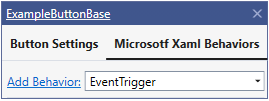
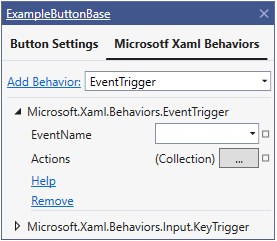

## Suggested Actions - Behaviors





```cs
public class ExampleBehaviorActionProvider : BehaviorActionProvider
{
    //Specify Behavior attached property name
    public override string BehaviorPropertyName => "Triggers";

    //Specify fully qualified type name of a class that implements a Behavior attached property
    public override string BehaviorPropertyTypeFullName => "Microsoft.Xaml.Behaviors.Interaction";

    public override string Header => "Microsoft Xaml Behaviors";

    //Specify full name of control type for which current provider is created.
    public override string Type => "System.Windows.FrameworkElement";

    //Set 'AppearsOnInheritedTypes' to 'true', so this provider will be shown for all types
    //inherited from 'System.Windows.FrameworkElement'
    public override bool AppearsOnInheritedTypes => true;

    public override void Initialize()
    {
        //Specify all available behaviors with properties as a BehaviorActionGroup.
        //Add any other action.
        //Remove button will be added automatically.
        this.AddGroup(new BehaviorActionGroup("Microsoft.Xaml.Behaviors.EventTrigger",
                                               new PropertyAction("EventName"),
                                               new PropertyAction("Actions"),
                                               new LinkAction("Help", () => { Process.Start("https:/github.com/microsoft/XamlBehaviorsWpf/blob/master/srcMicrosoft.Xaml.Behaviors/EventTrigger.cs"); })));

        this.AddGroup(new BehaviorActionGroup("Microsoft.Xaml.Behaviors.Input.KeyTrigger",
                                      new PropertyAction("SourceName"),
                                      new PropertyAction("SourceObject"),
                                      new PropertyAction("ActiveOnFocus")));
                                      
        this.AddGroup(new BehaviorActionGroup("Microsoft.Xaml.Behaviors.Core.TimerTrigger",
                                      new PropertyAction("MillisecondsPerTick"),
                                      new PropertyAction("TotalTicks")));
    }
}

```

### Metadata registration
```CS
...
//Add SuggestionsAttribute to enabled "XAML Suggested Actions for control"
builder.AddCustomAttributes("System.Windows.FrameworkElement", new SuggestionsAttribute());

//Add Behavio provider
builder.AddCustomAttributes("System.Windows.FrameworkElement", new FeatureAttribute(typeof(ExampleBehaviorActionProvider)));
...
```