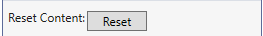
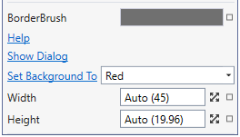
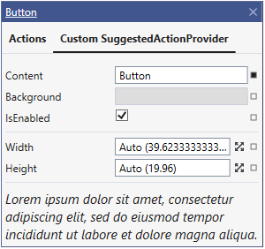
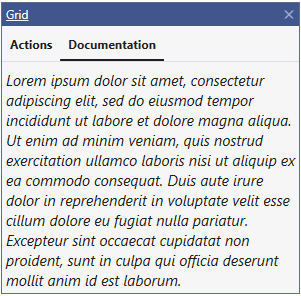

## Suggested Actions Customization

There are multiple ways that you can customize the view of "XAML Suggested Actions":

### 1. Action


To make a custom action use `CustomAction` class:

```cs
public class MyCustomAction : CustomAction
{
    private SuggestedActionsResources res = new SuggestedActionsResources();
    
    public string MyCustomActionText { get; }
    public ICommand ResetCommand { get; }
    
    public MyCustomAction()
    {
        this.Template = res["MyCustomActionTemplate"] as ControlTemplate;
        this.MyCustomActionText = "Reset Content:";
        this.ResetCommand = new ResetCommandImpl();
    }

    private class ResetCommandImpl : ICommand
    {
        public event EventHandler CanExecuteChanged;
        public bool CanExecute(object parameter)
        {
            return true;
        }
        public void Execute(object parameter)
        {
            if (parameter is ModelItem modelItem)
            {
                modelItem.Content.SetValue("Content");
            }
        }
    }
}
```
```xml
<ControlTemplate x:Key="MyCustomActionTemplate">
    <StackPanel Orientation="Vertical">
        <TextBlock Text="{Binding MyCustomActionText}"/>
        <Button Width="60" Height="20" Margin="2" HorizontalAlignment="Center"
                Content="Reset" 
                Command="{Binding ResetCommand}" CommandParameter="{Binding ModelItem}"/>
    </StackPanel>
</ControlTemplate>
```
>DataContext for ControlTemplate will be set to `MyCustomAction`
```cs
public class ButtonCustomActionTemplateProvider : SuggestedActionProvider
{
    public override string Header => "Custom Action";
    public override string Type => "System.Windows.Controls.Button";
    public override void Initialize()
    {
        base.Initialize();
        this.AddAction(new MyCustomAction());
    }
}
```

### 2. ActionGroup

```cs
public class MyCustomActionGroup : ActionGroup
{
    private SuggestedActionsResources res = new SuggestedActionsResources();

    public PropertyAction BackgroundProperty { get; set; }
    public LinkAction HelpLinkAction { get; set; }
    public CommandAction ShowDialogCommandAction { get; set; }
    public SelectableAction SetBackgroundToAction { get; set; }

    public MyCustomActionGroup()
    {
        this.Template = res["MyCustomActionGroupTemplate"] as ControlTemplate;
    }

    public override void Initialize()
    {
        base.Initialize();

        this.Actions.Add(new PropertyAction("Width"));
        this.Actions.Add(new PropertyAction("Height"));

        this.BackgroundProperty = new PropertyAction("BorderBrush");
        //IMPORTANT: If action is a direct child of ActionGroup, this call is required after creating of action to correctly initialize it.
        this.BackgroundProperty.SetActionProvider(this.ActionProvider);
        
        this.HelpLinkAction = new LinkAction("Help", () => { Process.Start("https:/github.com/microsoft/xaml-designer-extensibility"); });
        this.HelpLinkAction.SetActionProvider(this.ActionProvider);
        
        this.ShowDialogCommandAction = new CommandAction("Show Dialog", new ShowDialogCommand("Dialog Text"), "Dialog Title");
        this.ShowDialogCommandAction.SetActionProvider(this.ActionProvider);
        
        this.SetBackgroundToAction = new SelectableAction("Set Background To");
        this.SetBackgroundToAction.Items = new System.Collections.GenericDictionary<string, object>()
        {
            { "Red", "#FFFF0000" },
            { "Green", "#FF00FF00" },
            { "Blue", "#FF0000FF" }
        };
        this.SetBackgroundToAction.Action = (color) =>
        {
            //Create SolidColorBrush
            ModelItem solidColorBrush = ModelFactory.CreateItem(this.ModelItem.Context, new TypeIdentifier("System.Windows.Media.SolidColorBrush"));
            PropertyIdentifier colorPropertyIdentifier = new PropertyIdentifier(new TypeIdentifier("System.Windows.Media.SolidColorBrush"), "Color");
            solidColorBrush.Properties[colorPropertyIdentifier].SetValue(color.ToString());
            //Set Background for control
            PropertyIdentifier backgrounPropertyIdentifier = new PropertyIdentifier(new TypeIdentifier("System.Windows.Controls.Control"), "Background");
            this.ModelItem.Properties[backgrounPropertyIdentifier].Collection.Add(solidColorBrush);
        };
        
        this.SetBackgroundToAction.SetActionProvider(this.ActionProvider);
    }
}
```
```xml
<ControlTemplate x:Key="MyCustomActionGroupTemplate">
    <StackPanel Orientation="Vertical">
        <Control Template="{DynamicResource DefaultPropertyActionControlTemplate}"
                 DataContext="{Binding BackgroundProperty}"/>
        <Control Template="{DynamicResource DefaultLinkActionControlTemplate}"
                 DataContext="{Binding HelpLinkAction}"/>
        <Control Template="{DynamicResource DefaultCommandActionControlTemplate}"
                 DataContext="{Binding ShowDialogCommandAction}"/>
        <Control Template="{DynamicResource DefaultSelectableActionControlTemplate" 
                 DataContext="{Binding SetBackgroundToAction}"/>

        <Control Template="{DynamicResource DefaultActionGroupControlTemplate}"/>
    </StackPanel>
</ControlTemplate>
```
```cs
public class ButtonCustomActionGroupTemplateProvider : SuggestedActionProvider
{
    public override string Header => "Custom Action Group";
    public override string Type => "System.Windows.Controls.Button";
    public override void Initialize()
    {
        base.Initialize();
        this.AddGroup(new MyCustomActionGroup());
    }
}
```

### 3. SuggestedActionProvider

```cs
public class MyCustomSuggestedActionProvider : SuggestedActionProvider
{
    private SuggestedActionsResources res = new SuggestedActionsResources();

    public override string Header => "Custom SuggestedActionProvider";
    public override string Type => "System.Windows.Controls.Button";
    public string ShortDocumentation { get; }

    public override void Initialize(ModelItem modelItem)
    {
        base.Initialize(modelItem);
        this.Template =  this.res["MyCustomSuggestedActionProviderTemplate"] as ControlTemplate;
        this.ShortDocumentation = "Lorem ipsum dolor sit amet, consectetur adipiscing elit, sed do eiusmod tempor incididunt ut labore et dolore magna aliqua.";
    }

    public override void Initialize()
    {
        base.Initialize();

        this.AddGroup(new ActionGroup(ButtonActionProvider.Token_Group_Common,
            new PropertyAction(ButtonActionProvider.Token_Property_Content, "Content"),
            new PropertyAction(ButtonActionProvider.Token_Property_Background, "Background"),
            new PropertyAction(ButtonActionProvider.Token_Property_IsEnabled, "IsEnabled")
            ));
        
        this.AddGroup(new ActionGroup(
                new PropertyAction("Width"),
                new PropertyAction("Height")                
            ));
    }
}
```
```xml
<ControlTemplate x:Key="MyCustomSuggestedActionProviderTemplate">
    <StackPanel Orientation="Vertical">
        <Control Template="{DynamicResource DefaultActionGroupListControlTemplate}"/>
        <TextBlock Text="{Binding ShortDocumentation}"
                   Margin="4" FontStyle="Italic" FontSize="15" TextWrapping="Wrap"/>
    </StackPanel>
</ControlTemplate>
```

### 4. ActionProviderBase 

```cs
public class MyCustomActionProvider : ActionProviderBase
{
    private SuggestedActionsResources res = new SuggestedActionsResources();

    public override string Header => "Documentation";
    public override string Type => "System.Windows.Controls.Grid";
    public string Documentation { get; }

    public override void Initialize(ModelItem modelItem)
    {
        base.Initialize(modelItem);
        this.Template =  this.res["MyCustomActionProviderTemplate"] as ControlTemplate;

        this.Documentation = @"Lorem ipsum dolor sit amet, consectetur adipiscing elit,sed do eiusmod tempor incididunt ut labore et dolore magna aliqua. Ut enim adminim veniam, quis nostrud exercitation ullamco laboris nisi ut aliquip ex eacommodo consequat. Duis aute irure dolor in reprehenderit in voluptate velit essecillum dolore eu fugiat nulla pariatur. Excepteur sint occaecat cupidatat nonproident, sunt in culpa qui officia deserunt mollit anim id est laborum.";
    }
}
```
```xml
<ControlTemplate x:Key="MyCustomActionProviderTemplate">
    <TextBlock Text="{Binding Documentation}" 
               Margin="4" FontStyle="Italic" FontSize="15" TextWrapping="Wrap"/>
</ControlTemplate>
```


>Default Templates:<br/>
>- Property Action:  `DefaultPropertyActionControlTemplate`
>- Link Action: `DefaultLinkActionControlTemplate`
>- Command Action: `DefaultCommandActionControlTemplate`
>- Selectable Action: `DefaultSelectableActionControlTemplate`
>- Action Group: `DefaultSelectableActionControlTemplate`
>- List Of ActionGroups: `DefaultActionGroupListControlTemplate`
