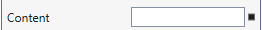
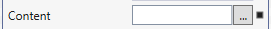
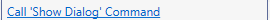
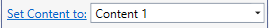

## Suggested Actions Features

Currently we have 5 types of actions that could be added:
## *PropertyAction*
```cs
//Simple Property Editor will be shown
PropertyAction propertyAction = new PropertyAction("Content");
```


```cs
//Property Editor with '...' button will be shown
PropertyAction propertyActionWithDialogButton = new PropertyAction("Content");
propertyActionWithDialogButton.DialogOpenAction = () =>
            {
                MessageBox.Show("Dialog Text");
            };
```


## *LinkAction* - hyperlink label that invokes custom action
```cs
LinkAction linkAction = new LinkAction("Help", () =>
{
    Process.Start("http://microsoft.com");
};
```


## *CommandAction* - hyperlink label that invokes existing command
```cs
ShowDialogCommand showDialogCommand = new ShowDialogCommand("Dialog Text");
CommandAction commandAction = new CommandAction("Call 'Show Dialog' Command", showDialogCommand, "CommandParameterObject"))
```


## *SelectableAction* - hyperlink label that invokes custom action with parameter from ComboBox
```cs
SelectableAction selectableAction = new SelectableAction("Set Content to:");
selectableAction.Items = new Dictionary<string, object>()
    {
        { "Content 1", "Test Content 1" },
        { "Content 2", "Test Content 2" }
    };
selectableAction.Action = (obj) =>
{
    this.ModelItem.Content.SetValue(obj);
};
```


## *CustomAction* - action with custom template
```cs
public class MyCustomAction : CustomAction
{
    private SuggestedActionsResources res = new SuggestedActionsResources();
    
    public string MyCustomActionText { get; set; }
    public ICommand ResetCommand { get; set; }
    
    public MyCustomAction()
    {
        this.Template = res["MyCutsomActionTemplate"] as ControlTemplate;
        this.MyCustomActionText = "Change Content oprions:";
        this.ResetCommand = new ResetCommandImpl();
    }

    private class ResetCommandImpl : ICommand
    {
        public event EventHandler CanExecuteChanged;
        public bool CanExecute(object parameter)
        {
            return true;
        }
        public void Execute(object parameter)
        {
            (parameter as ModelItem).Content.SetValue("Content");
        }
    }
}
```
XAML from `SuggestedActionsResources` ResourceDictionary:
```xml
<ControlTemplate x:Key="MyCutsomActionTemplate">
    <StackPanel Orientation="Vertical">
        <TextBlock Text="{Binding MyCustomActionText}"/>
        <Button Width="60" Height="20" Margin="2" HorizontalAlignment="Center"
                Content="Reset" 
                Command="{Binding ResetCommand}" CommandParameter="{Binding ModelItem}"/>
    </StackPanel>
</ControlTemplate>
```