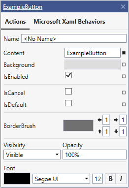
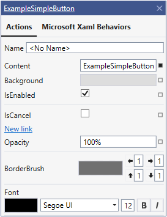

## Suggested Actions Extensibility

- [Tokens](./xaml-designer-suggested-actions-extensibility-tokens.md)
- [Features](./xaml-designer-suggested-actions-extensibility-features.md)
- [Behaviors](./xaml-designer-suggested-actions-extensibility-behaviors.md)
- [Non-Visual Elements](./xaml-designer-suggested-actions-extensibility-nonvisualelements.md)
- [Customization](./xaml-designer-suggested-actions-extensibility-customization.md)

In Visual Studio 2019 16.7 Preview 3 we added extensibility support for "XAML Suggested Actions"
>**Note:** This API is still in the preview stage and is available in Visual Studio 16.8 Preview versions. However, since this feature is not going to GA for 16.8, it will be disabled in 16.8 Preview 6 (due to our process of building the GA from the last Preview) and re-enabled in 16.9 Preview 1.
>
>Our current plan is to release it in 16.9, which is a long-term servicing release, allowing you time to adapt your delivery process. This plan is preliminary and could be changed based on feature completeness.

To enable "Xaml Suggested Actions" for any control, a `SuggestedActionProvider` feature provider should be created and registered in metadata.

>*A Control could have multiple Suggested Actions providers. Each provider will be shown as a separate tab in the Suggested Actions UI.*

Example:
```cs
public class ExampleButton : Button { }
```



### Implementation for example above:
```CS
public class ExampleButtonSuggestedActionProvider : SuggestedActionProvider
{
    public static ActionToken Token_Property_IsCancel = new ActionToken(0x1001);
    public static ActionToken Token_Property_IsDefault = new ActionToken(0x1002);
    public static ActionToken Token_Last = new ActionToken(0x10FF);
    public override string Header => "Actions";
    public override void Initialize()
    {
        this.ShowNameProperty = true;
        base.Initialize();
        
        this.AddGroup(new ActionGroup(SuggestedActionProviderTokens.Token_Group_Common,
            new PropertyAction(SuggestedActionProviderTokens.Token_Property_Content, "Content"),
            new PropertyAction(SuggestedActionProviderTokens.Token_Property_Background, "Background"),
            new PropertyAction(SuggestedActionProviderTokens.Token_Property_IsEnabled, "IsEnabled")
            ));
        
        this.AddGroup(new ActionGroup(SuggestedActionProviderTokens.Token_Group_Specific,
            new PropertyAction(ExampleButtonSuggestedActionProvider.Token_Property_IsCancel,"IsCancel"),
            new PropertyAction(ExampleButtonSuggestedActionProvider.Token_Property_IsDefault,"IsDefault")));
        
        this.AddGroup(new BorderBrushActionGroup());
        this.AddGroup(new VisibilityActionGroup());
        this.AddGroup(new FontSettingsActionGroup());
    }
}
```
### Example for inherited controls
```cs
public class ExampleSimpleButton : ExampleButton { }
```



```CS
public class ExampleSimpleButtonSuggestedActionProvider : ExampleButtonSuggestedActionProvider
{
    public static ActionToken Token_Property_CustomProp = ExampleButtonSuggestedActionProviderToken_Last + 1;
    public new static ActionToken Token_Last = new ActionToken(0x2FFF);
    public override void Initialize()
    {
        base.Initialize();
        //Hide Visibility Group
        this.GetGroupByToken(SuggestedActionProviderTokens.Token_Group_VisibilitySettings).IsVisible =false;
        
        //Hide IsDefault Property
        this.GetActionByToken(ExampleSimpleButtonSuggestedActionProvider.Token_Property_IsDefault)IsVisible = false;
        
        //Add new Opacity (without Token) property after IsDefault (even if it was hidden before)
        this.InsertAction(new PropertyAction("Opacity"), after:ExampleSimpleButtonSuggestedActionProvider.Token_Property_IsDefault);
        
        //Add new Link Action after IsDefault - will be inserted after IsDefault, but before Opacity
        this.InsertAction(new LinkAction("New link", () => { }), after:ExampleSimpleButtonSuggestedActionProvider.Token_Property_IsDefault);
        
        //Subscribe to ModelItem Property Changed Event to update view if needed
        this.ModelItemPropertyChanged +=ExampleSimpleButtonSuggestedActionProvider_ModelItemPropertyChanged;
    }
    
    private void ExampleSimpleButtonSuggestedActionProvider_ModelItemPropertyChanged(object sender,PropertyChangedEventArgs e)
    {
        
    }
}
```

### Metadata registration
```CS
...
//Add one provider
builder.AddCustomAttributes("CustomControlLibrary.WpfCore.ExampleButton", new FeatureAttribute(typeof(ExampleButtonSuggestedActionProvider)));

//Same for another control
builder.AddCustomAttributes("CustomControlLibrary.WpfCore.ExampleSimpleButton", new FeatureAttribute(typeof(ExampleSimpleButtonSuggestedActionProvider)));
...
```

### Documentation link


At the top of the Suggested Actions dialog in the designer there is a Type Name label.
It could be used as a hyperlink to documentation. There are two ways to enable it:

1. Specify `DocumentationAttribute` in Metadata:

   ```csharp
   builder.AddCustomAttributes("System.Windows.Controls.ComboBox", 
                               new DocumentationAttribute(helpUrl: "https://docs.microsoft.com/en-us/dotnet/api/system.windows.controls.combobox"));
   ```

2. Create `DocumentationProvider` and register it in Metadata:

   ```csharp
   public class ButtonDocumentationProvider : DocumentationProvider
   {
       public override string GetHelpUrl(ModelItem modelItem)
       {
           return "https://docs.microsoft.com/en-us/dotnet/desktop/wpf/controls/button";
       }
   }
   
   //Metatdata registration:
   builder.AddCustomAttributes("System.Windows.Controls.Button",
                               new FeatureAttribute(typeof(ButtonDocumentationProvider));
   ```

   

>- If both `DocumentationAttribute`  and `DocumentationProvider` exist for the same type, `DocumentationAttribute`  will be used.
>- `DocumentationAttribute`  will not be searched in parent classes.
>- If `DocumentationProvider` has not been added, we will use the help URL from the first parent class that has this provider, otherwise the Type Name label will not be a hyperlink.